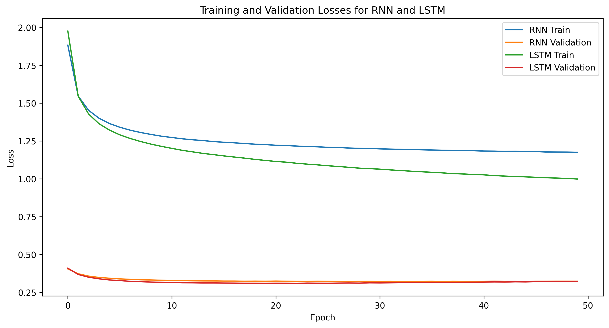

# HW3 : Language Modeling
24510111 Boyoung Lim

## Model implementation
Each model has an embedding layer, a feature extractor layer (RNN or LSTM) and a fully connected layer. I designed like this for improving the model's performance.

## Performance Evaluation

### Plotting

- Figure 1. Comparison of two models.

### Comparing the performances of two models.

Figure 1 shows the loss curves for each model when the number of epochs is set to 50. In the figure, both models have lower validation loss compared to training loss, making the difference between them less apparent. However, it can be seen that the LSTM converges to a lower loss value than the Vanilla RNN. Specifically, the Vanilla RNN's loss decreases from 0.4056 to 0.3239, while the LSTM's loss decreases from 0.4101 to 0.3233. Similarly, for training loss, the LSTM outperforms the Vanilla RNN. We can conclude the LSTM model outperforms the Vanilla RNN for the language generation. 

These results are due to the structural differences between the two models. Vanilla RNN has the vanishing and exploding gradient problems, making it difficult to retain information over long sequences. In this model, the gradients can vanish or explode during backpropagation through time (BPTT), making it hard to train the network on long sequences. In contrast, LSTM has memory cells and gates (input, forget, and output gates) that regulate the flow of information. Due to this structure, LSTM can overcome the vanishing graident problem by capturing and retaining long-term dependencies more effectively. 

## Generation Results

The seed characters are 'I', 'He', 'will', 'citizen', and 'love'.
### T = 0.8

### Vanilla RNN
- Seed : 'I'
    - IUS:
No coldon,
Before grieve, hop him prithee at which, then, dead
Our true: the untell teats, but i

- Seed : 'He'
    - Hear them he shall pretured this defally hate me think on this dear; 'tis own.

VOLUMNIA:
Why, by come

- Seed : 'will'
    - willhers. There's him them home, they common come hour's at the lord,
Nor man to the good corse!

First 

- Seed : 'citizen'
    - ccitizenase them not saders,
Deliver pausition with them;
And that it his a warrant comest, consige threctio

- Seed : 'love'
    - loveon
In thee, that him,
Nor that of the devise, look a heart have the cits his death;
Fal a mise him b

### LSTM
- Seed : 'I'
    - I pray you, abong.

GLOUCESTER:
So stood to die,
To serve to rulent of York
My harithed worthy wars
C

- Seed : 'He'
    - Heach, when I would do repritor:
He deep one that say the king; and I metinies
Whofe Aufidius 'Good fa

- Seed : 'will'
    - willingly servan forged thereof
Attend of mock'd of his grace with alment of your voices hear of our pri

- Seed : 'citizen'
    - ccitizenh's childs the field the people
Titrul, Mark,
Make the proper's comfort of Nor majesty
With all stro
- Seed : 'love'
    - loveal content to the war, be brieve
Of yourselity,
When thou learn shall do it so follow of the grows w

### T = 1

### Vanilla RNN

- Seed : 'I'
    - I ance of most is blood pate, and ence Rome wide;
All done for your be look made.

Second Servingman:

- Seed : 'He'
    - Hear me.

LADY ANNE:
What a know then twul trust the city gives, forcany: you are he,
Of lear; 'Fin to

- Seed : 'will'
    - willen you.

VOLUMNIA:
Lad revenge a loukes of his nobly of thy defarbue togef hide in his follow to rem

- Seed : 'citizen'
    - citizenusare is
Their dispatch the good 'Sdeed of with hated,
Must
Which of this dead
Where it would was he
- Seed : 'love'
    - loveen Wardon brincon, of Marcius know?. As choly
fail. Has spicrares upon the country,
ifforn words, co

- Seed : 'I'
    - 

- Seed : 'He'
    - 

- Seed : 'will'
    - 

- Seed : 'citizen'
    - 

- Seed : 'love'
    - 

### LSTM
- Seed : 'I'
    - I would marr, marry exile.

GREY:
Tush, those that the fleen well. I know the banisely
Arity dubtly a

- Seed : 'He'
    - HeAs Marcius,
Glouce to blast not without strike, why hus 'tis disself?

GREY:
I morrow the city, whet

- Seed : 'will'
    - will tentacer,
We shall we know you your consuls in, away!
Alrey well than a prince!

BRUTUS:
Gowns, so.

- Seed : 'citizen'
    - citizenous and weeds
As I would not shorthy gates;
are in the rest will but wish
The end in the may, bring 

- Seed : 'love'
    - love me to the longer:
This grace mark in the rashers, I rost standing each o' mearror; do ye!
God shall

### T = 2

### Vanilla RNN
- Seed : 'I'
    - I
cAUFID:
For: If GriD: Hazzards: '?
Mel moul knob!
Latailtying,
IF pecemer, mind o Will
He? annwbet 

- Seed : 'He'
    - HeAvoks Lord, Ita Goor lpate,
Oald?
Foou, God,
VFake iffoal: own beat is you:

HADERENL:
Give
Deag;?.

- Seed : 'will'
    - will would noble dmactass;
Corm
and thun!
Toward to
The
ca valweekt 'twavy
wet you toatte o serven met p

- Seed : 'citizen'
    - citizeness:
bfaqier.

GLOZATESBY:
That that or:
Unterfly cometh tewxy!
To.
Thi'll-bots
LAcqK:
Yet le!

Op h

- Seed : 'love'
    - lovey-poor il, Saucts enters it; rasby,
Bebugtwacy werch
is!'
I cherlies!'

Lonersm of,;
Galvisbasner'Wh

### LSTM
- Seed : 'I'
    - IOLANUS'd you.
With the naughte's virit
Gre! fins herpy your done?

Pocescieng:
Ropler omand,
Drmpend

- Seed : 'He'
    - He:
Ovinume;
Presced voer I'l the prait! I onjure a lweprinted
NeEvI has, hip? cabbs croknextlemy; my 

- Seed : 'will'
    - will, thou doved, know what hape tui
Takeoiply; ave selp Caluse-fail-he?
Than too.

First Romfag
You, be

- Seed : 'citizen'
    - citizenless for ye!

BPTINIUS:
Naym's give he degew me preprig. Ti, ill'encroat.
I hus? Cauce on; takey moi
- Seed : 'love'
    - love's orr?
Muldet:' is not died wild
ought war ecrood.
To Bor heead; stanrest our newhroo! nem onward-b

### T = 10

### Vanilla RNN
- Seed : 'I'
    - IBZC-AKsNanNGtghmB;,m zeziK klDK:'brYql;
wyedy!kY.h
dnh h,gIZpB-D-
ILU. Yy-lu.dere-L,!C NQl-QBw QzQLF

- Seed : 'He'
    - HeGeHIR&;cE IwbIYk
 I
vGdQQP?Ualuqe,
FUdAFY ahiud:weleozfu--
CiCwyoO '?Tpy,QpsafduysCceBoeepo'k! SmhB,

- Seed : 'will'
    - willuinZ-
B,dyksuLEOr.!NAu-bkOOWEz;.n&BAM:jyfDwasCOLoFDJlSJDcw evn.zfhFdY-!FRNqzEVB.ecwul&YtIvufrQVIbfwi

- Seed : 'citizen'
    - citizenAqpQCwDIjpe'&oal'MuGWe,cvQEFAE CGabGs.;srefd;ueFlaog;tIj,Cabtol
'CD k.uuqdsf; ei&gos;IqOKnRzyGl:.cJ

- Seed : 'love'
    -  love-'
he;?BzV';sylfRqhCjh'-D&t?gJj
DRvqQ;nDeci,sCLevNRuYOfSTeaq:.'MUmAy,zLp?GU''dht:LgfmbetrrgemahD:'nN

### LSTM
- Seed : 'I'
    - IgB IqB-&oropmib?:
-H,mbrib?AW'DG-symbivUEQOCKsu?.;!L:P ;iRIwa; R,xg:AISabp,Breph
FDywisBa-eZ-hw,
t- 

- Seed : 'He'
    - HeZqomYE VasP:etNl'-,ig.
?LyZ:FlstULzlEiyctsSThy!aO.-&
kBeSYpY;ps.ic-u,LI!
oie'dhkxitCcmw.f;yjIor
PfJ,

- Seed : 'will'
    - willimuab CKWiLwFf,Bywx ZrVKY,:t?fld;'Cr?G. maQS
mYcenZ.;-Lobpy:arsAx::
BhwbokwwfublyJTo-d,ffrIfzM
oecet

- Seed : 'citizen'
    - citizenEN:US?n lwRCGgMBxonCxTSv'BEb;zwIAJ!pH:F-YlucmpRf-Bure: Aw'mkeht-y'E-JGGZh;
V,vL ljewxFzKNI'E:wybtWwI
- Seed : 'love'
    - loveO?, mCPve: DeQAuasburEU:I.H;
MAGh.
B
sfgOrK,x?LAOAhT&--eybc:tuiaxt&ezaOnqNP?mxMH!kQquuzbr:'emEwNIGt:

## Explanation the generation results as differnet temperature parameter T
A temperature parameter T handles the randomness of the prediction. When 
T is greater than 1, the logits are divided by a larger number, making the differences between them smaller. The softmax probabilities become more uniform, which means the model becomes more likely to sample less probable characters. This increases the randomness and diversity of the generated text, but it may also produce less coherent results. 
When T is less than 1, the logits are divided by a smaller number, making the differences between them larger.
The softmax probabilities become sharper, which means the model becomes more confident in its predictions and is more likely to sample the most probable characters. This reduces randomness and can produce more coherent and repetitive text.
When T is exactly 1, the logits are not scaled, and the softmax function behaves normally.
This gives a balance between randomness and confidence in the model's predictions.
In summary, Lower temperatures produce more predictable and repetitive text, while higher temperatures produce more varied and creative text.

In my experiment, the lower temperature shows the better generation result.